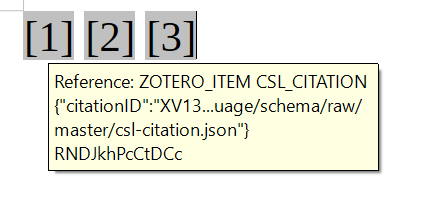
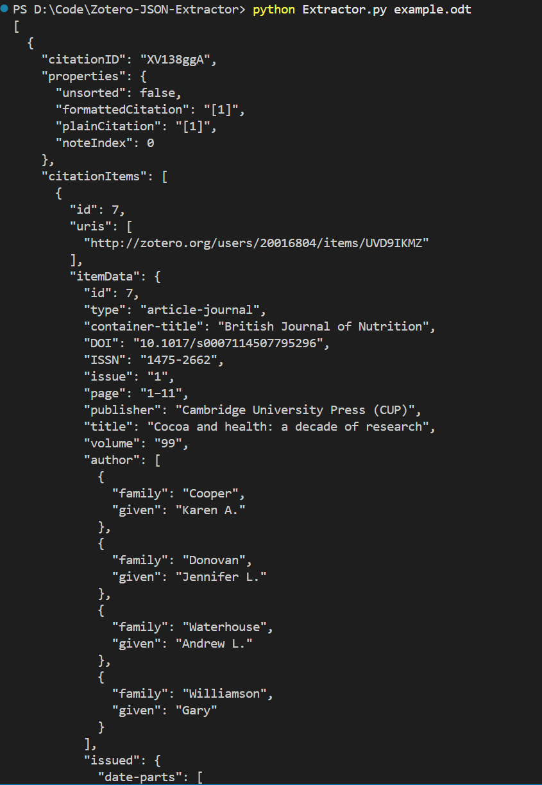

# Zotero JSON Extractor

Extract the complete CSL JSON stored in Zotero reference marks.

## Background

Zotero stores CSL citation metadata inside reference marks. Because the CSL JSON can be very large, it is difficult to inspect the complete JSON directly in LibreOffice Writer.



This tool extracts the complete CSL citation JSON from an `.odt` file or a `content.xml` file.

## Usage

The extractor currently supports `.odt` and `.xml` files.

Run:

```bash
python Extractor.py example.odt
```

or 
```bash
python Extractor.py "/filepath/xxxx.odt"
```

# Expected Result
Results should be similar to the image below.


